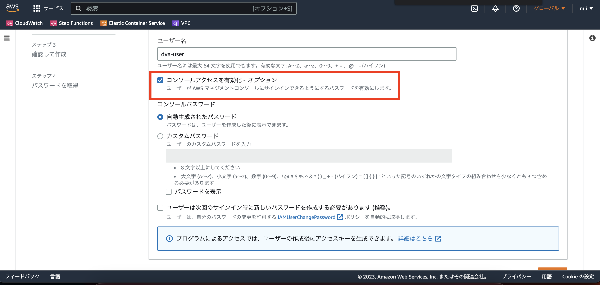
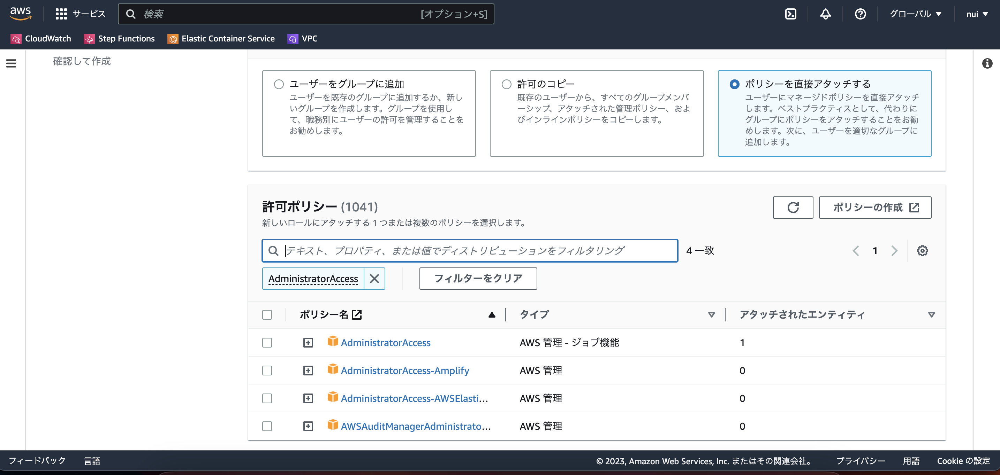
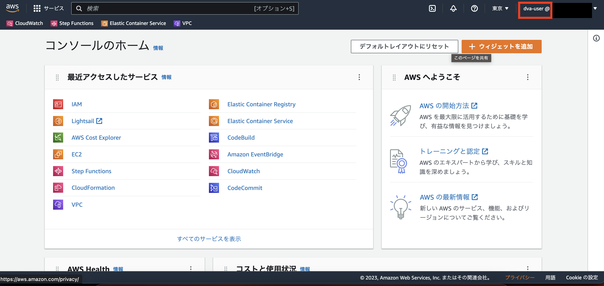
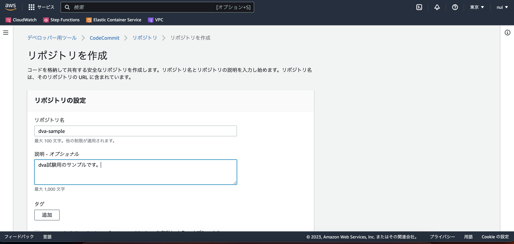
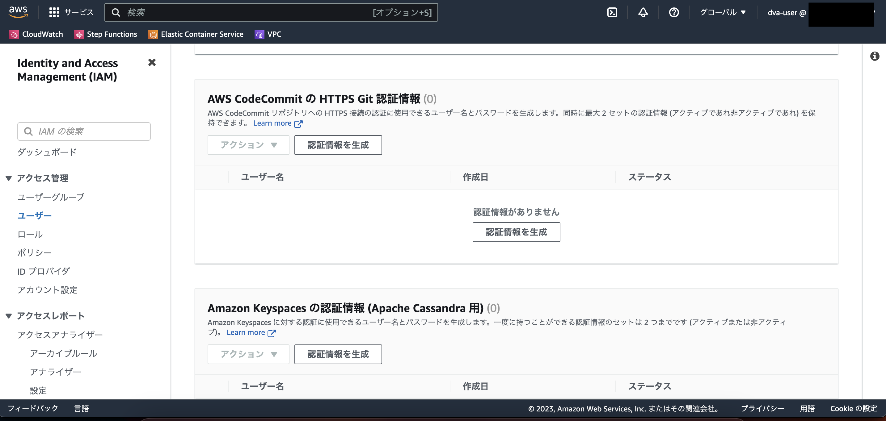
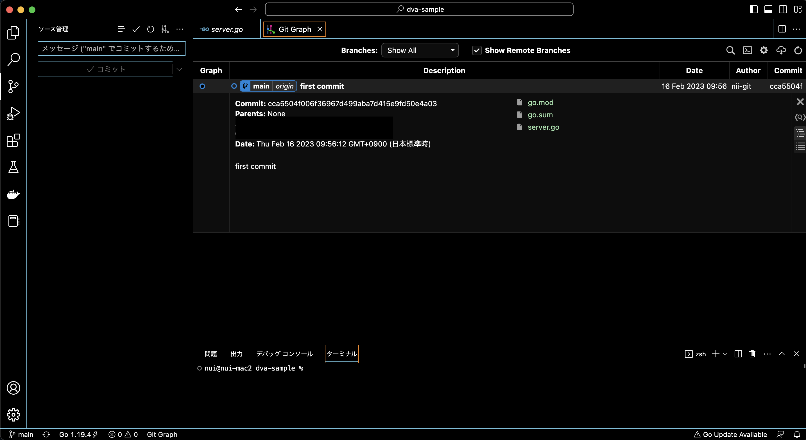
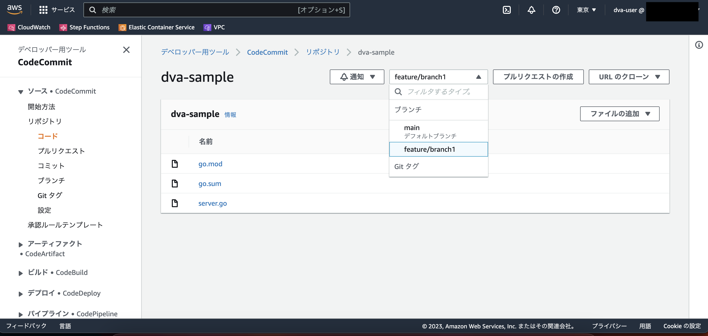

## Outline
AWS Certified Developer - Associate認定試験の対象のうち、デベロッパーツールを実際に設定する記事になります。 //todo
参考書だけの暗記ではなく、実際に画面を見てイメージしやすくするための助けになれば幸いです。 //todo

この記事で取り扱うサービスは下記の5つです。
- AWS CodeCommit
- AWS CodeBuild
- AWS CodePipeline
- AWS CodeDeploy
- AWS Elastic Beanstalk

なお、2023年2月28日よりDVA試験のバージョンが新しくなりますが、本記事で紹介するサービスは`試験の対象となる主要なツール、テクノロジー、概念`リストに含まれています。
https://d1.awsstatic.com/ja_JP/training-and-certification/docs-dev-associate/AWS-Certified-Developer-Associate_Exam-Guide_C02.pdf


## 事前準備

まずは、本記事でリソースを作成するためのIAMユーザーを作成します。

::: message
AWSでは、ルートユーザを最初のIAMユーザーを作成する時だけ使用することを推奨しているためです。
:::

`IAM > ユーザー > ユーザーを追加` に移動し、コンソールアクセスを有効化にチェックを入れてください。



許可ポリシーは一旦 `AdministratorAccess` 権限とします。



設定したメールアドレスとIDでログインし、IAMユーザーになっていることを確認してください。



## AWS CodeCommit
### 概要
> AWS CodeCommit は、クラウド内のアセット(ドキュメント、ソースコード、バイナリファイルなど) を非公開で保存および管理するために使用できるアマゾン ウェブ サービスによってホストされるバージョン管理サービスです。([公式ドキュメント](https://docs.aws.amazon.com/ja_jp/codecommit/latest/userguide/welcome.html))より引用

Githubのようなサービスのイメージを持っておけば問題ないと思います。

https://docs.aws.amazon.com/ja_jp/codecommit/latest/userguide/getting-started-cc.html

### 使ってみる
コンソールからリポジトリを手動で作成していきます。
`Codecommit > リポジトリ > リポジトリを作成` より、適当にリポジトリを作成します。

名前と説明を入力し、作成ボタンを押下します。



作成は以上で完了です。簡単ですね。

--- 

作成したリポジトリへ接続するには3パターンあります。
- HTTPS接続によるGit認証
  - IAMユーザーに対し Git認証情報を作成する
  - HTTP/HTTPSサーバを経由する場合やIDE使う場合
- SSH接続
  - 公開鍵/秘密鍵のペアを作成
  - gitコマンドを使用する場合
- git-remote-codecommit(grc)
  - Git,鍵の認証情報は不要
  - ルートアカウント、フェデレーティッドアクセス、または一時的な認証情報を使用する場合

今回はHTTPS接続によるGit認証で実施します。

::: message
Gitバージョンが1.7.9以上であることを確認してください。
> Git バージョン 1.7.9 以降をサポートしています。Git バージョン 2.28 は、初期コミットのブランチ名の構成をサポートしています。
```terminal
$ git --version
git version 2.37.1 (Apple Git-137.1)
```
:::

`IAM > User > セキュリティ認証情報 > AWS CodeCommit の HTTPS Git 認証情報 > 作成 > csv` より認証情報をダウンロードします。



その後、上記で作成したリポジトリをcloneします。username,passはGit認証情報のCSVを参考にしてください。

```terminal
$ git clone https://git-codecommit.ap-northeast-1.amazonaws.com/v1/repos/{repoName}
Cloning into 'dva-sample'...
Username for 'https://git-codecommit.ap-northeast-1.amazonaws.com': ******
Password for 'https://dva-user-at-162265692617@git-codecommit.ap-northeast-1.amazonaws.com':  ******
warning: You appear to have cloned an empty repository.
$ ls
dva-sample aws_new_user_credentials.csv
```

これで初期設定は完了です。

---

初期設定が完了した後は、ローカルでブランチを作成したりコミットしたり操作してみます。

適当にコミットした例(Visual StudioのGit Grpah拡張機能を使用)


gitを操作するとCodeCommitにも反映されていることがわかります。



### 試験に関して
Gitの基本操作がわかっていればなんとかなりそう //todo
CodeCommit APIの名前も
セットアップに関して、３パターンの設定方法の使い分けを覚えておく


## AWS CodeBuild
### 概要
> AWS CodeBuild はクラウドで動作する、完全マネージド型のビルドサービスです。CodeBuild はソースコードをコンパイルし、単体テストを実行して、すぐにデプロイできるアーティファクトを生成します。((公式サイト)[https://docs.aws.amazon.com/ja_jp/codebuild/latest/userguide/welcome.html]より引用)


### 使ってみる
